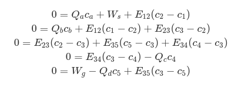
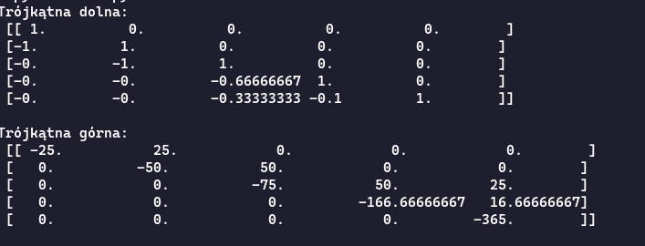
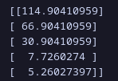

# Mikołaj Galant - Laboratorium Metody Numeryczne - Sprawozdanie

## Ukad równiań opisujących przepływ CO między pomieszczeniami

## Zapis równań jako równanie macierzowe $Ac=b$

$$
\begin{bmatrix}
-E_{12} & E_{12} & 0 & 0 & 0\\
E_{12} & -E_{12}-E_{23} & E_{23} & 0 & 0\\
0 & E_{23} & -E_{23}-E_{34}-E_{35} & E_{34} & E_{35}\\
0 & 0 & E_{34} & -E_{34}-Q_c & 0\\
0 & 0 & -E_{35} & 0 & -E_{35}-Q_d 
\end{bmatrix}
\begin{bmatrix}
c_1\\
c_2\\
c_3\\
c_4\\
c_5
\end{bmatrix}=
\begin{bmatrix}
-W_s - Q_ac_a\\
-Q_bc_b\\
0\\
0\\
-W_g
\end{bmatrix}
$$

## Znaleziono następujące rozwiązanie wektora $c$, macierze $L$ i $U$
### Wektor $c$
$$
\begin{bmatrix}
169,83561644\\
93,83561644\\
43,83561644\\
10,95890411\\
9,5890411
\end{bmatrix}
$$
Każda z liczb jest wyrażona w $mg/m^3$.

### Macierz $L$

## Zmiana wektora rozwiazania dla $W_s = 800 mg/h$ i $W_g = 1200 mg/h$

Widać zmniejszenie na każej z wartości stężenia CO panującej w każdym pomieszczeniu. Wynika to ze zmniejszenia wartości strumienia obu źródeł CO.

## $A^{-1}$ wyznaczone za pomocą rozkładu LU

## Udział procentowy poszczególnych źródeł emisji CO

Udział procentowy grilla w pokoju dla dzieci to 6,25%, dla palaczy to 56,25%, a ulicy to 37,5%.

Po zmianie wartości emisji:
Udział procentowy grilla w pokoju dla dzieci to 4,25531915%, dla palaczy to 42,55319149%, a ulicy to 53,19148936%. **Widać znacący wzrot udziału emisji pochodzących z ulicy.**