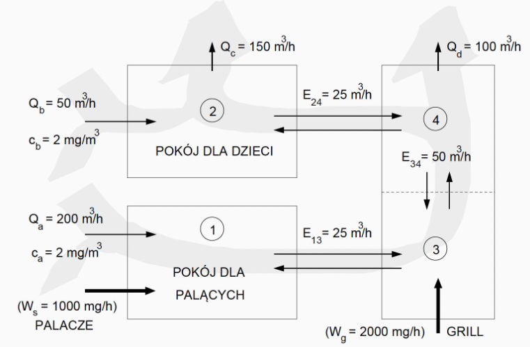

# Metody Numeryczne Lab 3

## 1. Definiowanie układów równań w postacji macierzowej

### Układ równań można zapisać za pomocą ogólnego równania macierzowego

$$AX = b$$

### Równanie można roziwązać przez odwrócenie macierzy $A$

$$x=A^{-1}*b$$

<center>

$A^{-1}={(A^D)^T}/{det(A)}$, gdzie $A^D$ to macierz dopełnień
</center>

### Rachunek macierzowy w numpy

[Link do dokumentacji numpy.linalg](https://numpy.org/doc/stable/reference/routines.linalg.html#module-numpy.linalg)

```python
# Deklaracja macierzy
np.matrix('1 2; 3 4')
np.matrix([[1, 2], [3, 4]])

# Odwrócenie macierzy
A_inverse = np.linalg.inv(A)

# Mnożenie macierz typu dot
np.vdot(a,b)

# Mnożenie macierzy
np.matmul(A, B)
```

### Proces odrwacania macierzy może być uciążliwy rachunkowo, więc stosuje się faktoryzację LU

## 2. Faktoryzacja LU i wyznaczanie macierzy odwrotnej

### Teoria

Załóżmy przypadek:

$$Ax = b_i, i = 1, 2, 3, ..., k$$

Faktoryzacja LU pozwala na odseparowanie
złożonej numerycznie faktoryzacji macierzy A od manipulacji na elementach
wektora b.

Zakładamy przekszałcenie układu do układu z macierzą trójkątną górną:

$$
\begin{bmatrix}
u_{11} & u_{12} & u_{13}\\
0 & u_{22} & u_{23}\\
0 & 0 & u_{33}
\end{bmatrix}
\begin{bmatrix}
x_1\\
x_2\\
x_3
\end{bmatrix}=
\begin{bmatrix}
d_1\\
d_2\\
d_3
\end{bmatrix}
$$

$$
Ux - d =0
$$

Zakładamy również, że istnieje macierz trójkątna dolna z 1 na głownej przekątnej

$$\begin{bmatrix}
1 & 0 & 0\\
l_{21} & 1 & 0\\
l_{31} & l_{32} & 1
\end{bmatrix}$$

<center>

$L[Ux-d]=Ax-b$
$LU=A$ oraz $Ld=B$
</center>

### Procedura

**Układ Ax = b można rozwiązać postępując zgodnie z poniższą procedurą:**
1. Dokonać takiego rozkładu macierz A na macierze trójkątną górną U, oraz
trójkątną dolną L (z 1 na głównej przekątnej), że LU = A.
2. Wyznaczyć wektor d rozwiązując układ równań Ld = b. Ze względu na
strukturę macierzy L nie jest to trudne.
3. Wyznaczyć wektor x rozwiązując układ równań Ux = d. Ze względu na
strukturę macierzy U nie jest to trudne.

### Faktoryzacja LU w numpy

#### Ze scipy

```python

import numpy as np
from scipy.linalg import lu
# Defining the matrix
A = np.array([[3, 2, 0], [1, -1, 0], [0, 5, 1]])

# Performing LU decomposition
P, L, U = lu(A)

# Printing the results
print("Lower Triangular:", "\n", L)
print("Upper Triangular:", "\n", U)
```

#### Bez scipy

```python
import numpy as np

def lu_decomposition(A):
    n = len(A)
    L = np.zeros((n, n))
    U = np.zeros((n, n))

    for i in range(n):
        L[i][i] = 1
        for j in range(i+1, n):
            L[j][i] = A[j][i] / A[i][i]
            for k in range(i+1, n):
                A[j][k] = A[j][k] - L[j][i] * A[i][k]
        for j in range(i, n):
            U[i][j] = A[i][j]
    return L, U

# Defining the matrix
A = np.array([[3, -0.1, -0.2], [0.1, 7, -0.3], [0.3, -0.2, 10]])

# Performing LU decomposition
L, U = lu_decomposition(A)
```

## 3. Analiza stężenia substancji szkodliwych na podstawie przepływu powietrza - analiza na podstawie wykładu



1. $0 = W_s +Q_ac_a-Q_ac_1 +E_{13}(c_3-c1)$
2. $0 = Q_bc_b+ Q_ac_4+E_{24}(c_4-c_2)-Q_cc_2-Q_dc_4$
3. $0 = W_g + E_{13}(c_1-c_3)+E_{34}(c_4-c_3) -Q_ac_3$
4. $0 = Q_ac_3+E_{34}(c_3-c_4)-Q_dc_4-E_{24}(c_2-c_4)$

**$$Ac =W,$$**
**gdzie na miacierz $A$ składają się składniki $Q$ jak i $E$**
